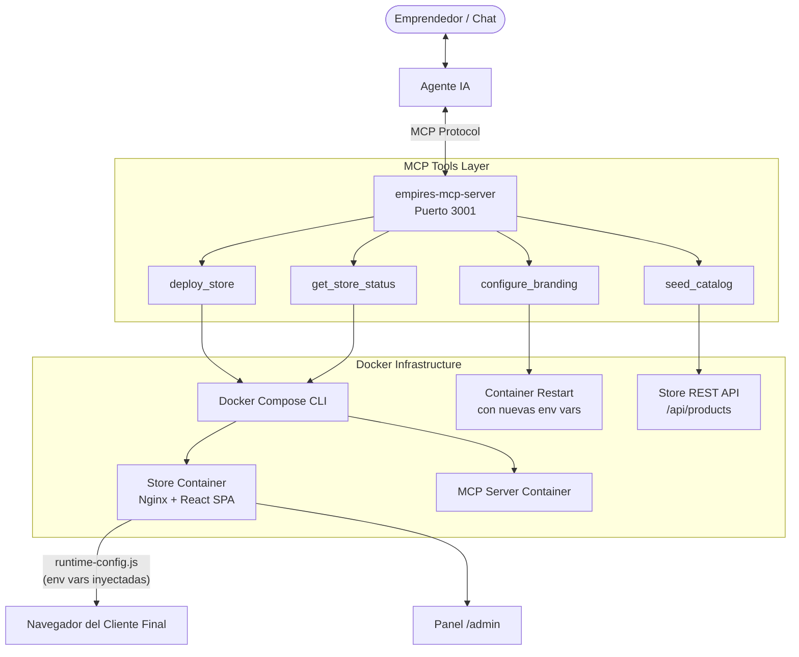

# MCP Blueprint — Empires Jewelry Conversational eCommerce Engine

## Visión General

Este proyecto convierte la aplicación **Empires Jewelry** en un ecosistema de despliegue conversacional donde cualquier emprendedor puede lanzar, personalizar y gestionar su propia tienda de joyería en línea **únicamente a través del chat**, sin conocimientos técnicos ni acceso a servidores.

```
Emprendedor en chat → Agente IA (Claude/Antigravity/Cursor)
                            ↓ llama herramientas MCP
                     MCP Server (empires-mcp-server)
                            ↓ orquesta
                     Docker Compose → Contenedor de Tienda
                            ↓ sirve
                     URL pública + Panel /admin
```

---

## Arquitectura del Sistema



---

## Esquemas de Herramientas MCP

### `deploy_store`

Despliega una nueva instancia de tienda con configuración completa.

| Parámetro | Tipo | Requerido | Descripción |
|-----------|------|-----------|-------------|
| `storeName` | string | ✅ | Nombre de la marca, e.g. "Perla Negra" |
| `storeWhatsappPhone` | string | ✅ | Número internacional: `+525512345678` |
| `storeCurrency` | string | ✅ | ISO 4217: `USD`, `COP`, `MXN`, `EUR`, `PEN`... |
| `storeAdminPin` | string | ✅ | PIN del panel `/admin` (mínimo 4 chars) |
| `storePrimaryColor` | string | ⬜ | Color primario hex: `#E5C158` |
| `storeAccentColor` | string | ⬜ | Color de contraste hex: `#1A1A1A` |
| `storeTagline` | string | ⬜ | Frase de marca |
| `storeLogoUrl` | string | ⬜ | URL de imagen del logo |

**Retorno:**
```
✅ ¡Tienda "Perla Negra" desplegada con éxito!

🌐 URL Pública: http://localhost:3100
🔐 Panel de Administración: http://localhost:3100/admin
📲 WhatsApp de Ventas: +525512345678
💰 Moneda: MXN
📦 Proyecto Docker: `perla-negra`
```

---

### `configure_branding`

Actualiza la identidad visual de una tienda en vivo **sin reconstruir** la imagen Docker.

| Parámetro | Tipo | Requerido | Descripción |
|-----------|------|-----------|-------------|
| `projectName` | string | ✅ | Nombre del proyecto Docker (retornado por `deploy_store`) |
| `storeName` | string | ⬜ | Nuevo nombre de la marca |
| `storePrimaryColor` | string | ⬜ | Nuevo color primario hex |
| `storeAccentColor` | string | ⬜ | Nuevo color de contraste hex |
| `storeTagline` | string | ⬜ | Nueva frase de marca |
| `storeLogoUrl` | string | ⬜ | Nueva URL del logo |
| `storeWhatsappPhone` | string | ⬜ | Nuevo número WhatsApp |

**Tiempo de actualización:** < 5 segundos (reinicio del contenedor).

---

### `seed_catalog`

Importa productos en bloque a través de la API REST de la tienda.

| Parámetro | Tipo | Requerido | Descripción |
|-----------|------|-----------|-------------|
| `storeApiUrl` | string | ✅ | URL base de la API: `http://localhost:3100/api` |
| `adminPin` | string | ✅ | PIN de administración |
| `products` | array | ✅ | Array de hasta 100 productos |

**Estructura de cada producto:**
```jsonc
{
  "name": "Anillo Solitario",
  "price": 850.00,
  "category": "anillos",            // anillos | collares | pulseras | aretes | alta-joyeria
  "description": "Diamante central 0.5ct",
  "material": "Oro Blanco 18k",
  "images": ["https://cdn.mitienda.com/anillo1.jpg"],
  "featured": true,
  "availability": "disponible"       // disponible | bajo-pedido | pieza-unica | agotado
}
```

---

### `get_store_status`

Consulta el estado de salud de los contenedores en tiempo real.

| Parámetro | Tipo | Requerido | Descripción |
|-----------|------|-----------|-------------|
| `projectName` | string | ✅ | Nombre del proyecto Docker |
| `showLogs` | boolean | ⬜ | Incluir logs recientes (default: false) |
| `logLines` | number | ⬜ | Número de líneas de log (default: 50, max: 200) |

---

## Flujo de Inyección de Configuración en Runtime

El sistema de inyección evita rebuilds de Docker para cada instancia de tienda:

```
Docker container start
       ↓
entrypoint.sh lee variables de entorno (STORE_NAME, STORE_WHATSAPP_PHONE, etc.)
       ↓
Genera /usr/share/nginx/html/runtime-config.js:
  window.__RUNTIME_CONFIG__ = { storeName: "...", ... }
       ↓
Nginx sirve el archivo con Cache-Control: no-store
       ↓
index.html carga runtime-config.js ANTES que el bundle React
       ↓
src/utils/runtimeConfig.ts lee window.__RUNTIME_CONFIG__
       ↓
React renderiza con la configuración de la tienda correcta
```

---

## Modos de Transporte del Servidor MCP

### STDIO — Para Claude Desktop / Cursor / Antigravity CLI

Configuración `claude_desktop_config.json`:
```json
{
  "mcpServers": {
    "empires-jewelry": {
      "command": "node",
      "args": ["/ruta/al/proyecto/mcp-server/dist/index.js"],
      "env": {
        "MCP_TRANSPORT": "stdio"
      }
    }
  }
}
```

### HTTP + SSE — Para integraciones web / chatbots propios

```bash
# Iniciar servidor
MCP_TRANSPORT=http PORT=3001 node mcp-server/dist/index.js

# El agente se conecta al endpoint SSE:
GET http://localhost:3001/sse

# Y envía llamadas de herramientas a:
POST http://localhost:3001/messages?sessionId=<id>
```

---

## Estrategia Multi-Tenant (Múltiples Tiendas en un VPS)

Cada tienda es un proyecto Docker Compose independiente con su propio nombre de proyecto y puerto. No comparten redes ni volúmenes. Un solo VPS de 2 vCPU / 4 GB RAM puede alojar cómodamente 10-20 tiendas simultáneas.

```
VPS Host
├── proyecto: perla-negra     → puerto 3100
├── proyecto: joya-dorada     → puerto 3102
├── proyecto: aurora-joyas    → puerto 3104
└── proyecto: empires-main    → puerto 3106

MCP Server (único) → gestiona todos los proyectos
Reverse Proxy (Caddy/Traefik) → enruta por subdominio con SSL automático
```

---

## Seguridad

| Aspecto | Implementación |
|---------|---------------|
| Admin Auth | PIN/password hasheado en `storeAdminPin` → JWT temporal en la API |
| Aislamiento | Cada tienda en red Docker bridge separada |
| CORS | Configurado en Nginx por origen |
| Secrets | Nunca en el código, siempre via `.env` o variables de entorno del contenedor |
| Docker Socket | El MCP server solo accede al socket si se habilita explícitamente para gestión multi-store |

---

## Estructura de Archivos Generados

```
templates/jewelry/  (o templates/clothing/, según el niche)
├── docker/
│   ├── Dockerfile              # Multi-stage build React + Nginx
│   ├── docker-compose.yml      # Single-store deployment
│   ├── entrypoint.sh           # Runtime env injection
│   └── nginx.conf              # SPA fallback + gzip + health check
├── mcp-server/
│   ├── Dockerfile              # MCP server image
│   ├── package.json
│   ├── tsconfig.json
│   └── src/
│       ├── index.ts            # Server entry + transport selection
│       ├── tools/
│       │   ├── deploy.ts       # deploy_store tool
│       │   ├── branding.ts     # configure_branding tool
│       │   ├── catalog.ts      # seed_catalog tool
│       │   └── monitor.ts      # get_store_status tool
│       └── utils/
│           ├── docker.ts       # Docker Compose wrapper
│           └── env-generator.ts # Zod schema validation
├── src/utils/runtimeConfig.ts  # Frontend runtime config reader
├── .env.template               # Template de variables por tienda
└── index.html                  # Carga runtime-config.js pre-React
```
